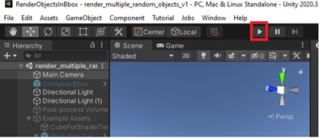
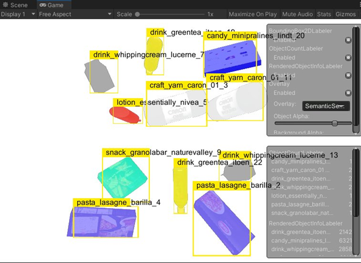
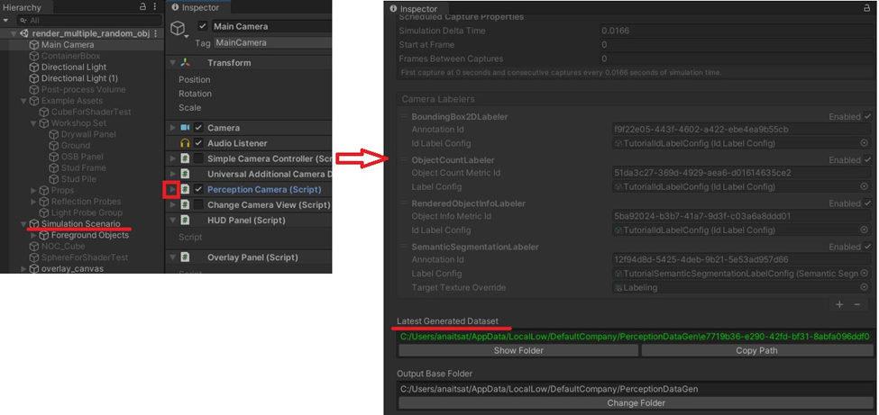

# Tool for Generating 3D Synthetic Data of Supermarket Products
Image generator tool for training 3D reconstruction and object segmentation networks. The tool renders  supermarket products under randomized conditions along with  segmentation  masks and color-coded  renderings of different ground truth parameters. It's build on top of [Unity Perception Package](https://docs.unity3d.com/Packages/com.unity.perception@0.5/manual/index.html) (version [0.9.0](https://github.com/Unity-Technologies/com.unity.perception/releases/tag/Release-0.9.0.preview.2) or  later)


> Initially this tool was design for generating training data for automatic store AI solutions, therefore  it contains 3D models of supermarket products only. However this tool can be applied for any set of 3D objects to generate a more general training  data for objet detection/segmentation and 3D reconstruction tasks
## Main Features 
Relative to the baseline perception package it  has the following  additional features:
* wider randomization options for lighting, object rescaling and material settings 
* a set of material  shaders to color code various ground truth parameters, including instance segmentation masks and position of meshes  in  different 3D coordinate systems  
    - local/global cartesian coordinates, object normalized coordinates (NOC)
* much wider set of prefabs  of supermarket products 
* scripts for data postprocessing 
* automatic test/ train dataset partitioning 
* additional  multi-view settings for multiple cameras 


Below is the summary of major code file that being added or modified 
## Dataset structure 

```bash
.                       # dataset root
└── train/              # folders of samples selected for train data 
|   └── data/
|        └── i/         # sample number i selected for train data 
|        |    ├── frame_i_Color_00.png   # rendering of viewpoint 00
|        |    ├── frame_i_<shader_type>_00.png # color coding of an object parameter rendered
|        |    |                                # from viewpoint 00 with a given shader type
|        |    |                                # (could be several shaders to depict various parameters)
|        |    ├── ...    
|        |    ├── frame_i_Color_N.png    # rendering of viewpoint N
|        |    └── frame_i_<shader_type>_N.png  # color coding of an object parameter rendered
|        |                                     # from viewpoint 00 with a given shader type  
|        |
|        └── j/        # sample number j selected for train data 
|             ├── ...  # the same structure as in other samples 
|
|
└── test/              # test data with 
|   └── data/          # folders of samples selected for test data 
|        ├── ...        #  with the same structure as in train data  
|        ├── ...       
```

## Getting Started

### Setting up Dependencies
This tool is build on top of the perception toolkit, but it does no use all the  toolkit  packages 
Therefore, you can ether *setup the entire perception toolkit* according to [these instruction]() or setup *only the necessary packages* according to the following steps:

* Open the Unity project file ( [ProductGenerator]())
    - 
* Press the`Play` button after which Unity should download automatically all the external packages and you should see the following *Game tab*
    -  
* In a case some packages are still missing, download them manually following [these instructions](https://github.com/Unity-Technologies/com.unity.perception/blob/main/com.unity.perception/Documentation~/Tutorial/Phase1.md) 


### Setting Dataset path
1. In *Hierarchy* Tab, select `Main Camera` 
2. In *Inspector* Tab, press `Perception Camera` 
3. Scroll Down to the `Latest Generated Dataset` field to set the data path



### Setting rendering mode 

### Additional configurations


### Uploading your 3D models  