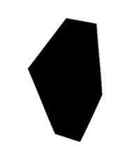

# Tool for Generating 3D Synthetic Data of Supermarket Products
Image generator tool for training 3D reconstruction and object segmentation networks. The tool renders  supermarket products under randomized conditions along with  metadata, segmentation  masks and color-coded  renderings of different ground truth parameters. It's built on top of [Unity Perception Package](https://docs.unity3d.com/Packages/com.unity.perception@0.5/manual/index.html) (version [0.9.0](https://github.com/Unity-Technologies/com.unity.perception/releases/tag/Release-0.9.0.preview.2) or  later)


> Initially, this tool was designed for generating training data for automatic store AI solutions, thus, it contains 3D models of supermarket products only. However this tool can be applied for any set of 3D objects to generate a more general training  data for object detection/segmentation and 3D reconstruction tasks (just add to the project folder your 3D models with randomization tags)

>  Tested with Unity 2020.3/Perception Package 0.9.0 on Windows 10 and debugged with Visual Studio Community 2019
## Main Features 
Relative to the baseline perception package it  has the following  additional features:
* wider randomization options for lighting, object rescaling and material settings 
* a set of material  shaders to color code various ground truth parameters, including instance segmentation masks and position of meshes  in  different 3D coordinate systems  
    - local/global cartesian coordinates, object normalized coordinates (NOC)
* much wider set of prefabs  of supermarket products 
* scripts for data postprocessing 
* automatic test/ train dataset partitioning 
* additional  multi-view settings for multiple cameras 

## Dataset Structure 
It generates two datasets: one containing  **3D reconstruction** data,  and another one contains **object detection / segmentation** data. Based on the configurations, it can be either for **monocular** or  **multi-view** settings.

### 3D reconstruction dataset

Adds PNG renderings to an existing  dataset folder or creates a new one (`Dataset` field of `FgObjectRandomizer` randomzier) 
> Currently supports only single foreground object mode
```bash
.                       # dataset root name 
├── train               # folder of samples selected for training data
│   ├── <1st_train_prefab>           # renderings of the 1st prefab for training   
│   │     ├── ...                                     # j_th frame of i_th camera placed around given rotation axis (= x,y,z)
│   │     ├── frame_j_Original_<axis><camera_i>.png   # here it's rendered with original prefab materials 
│   │     ├── frame_j_<material>_<axis><camera_i>.png # here with a given replacement material (= NOC, SegmentationMask etc.)
│   │     ├── ...                                     # other frames with other cameras 
│   └── <last_train_prefab>         # renderings of the last prefab for training
│         ├── ...                                     # (same structure for all prefabs)
│
└── test                # samples selected for test data
    ├── <1st_test_prefab>           # renderings of the 1st prefab for testing
    │     ├── ...                                    # (same structure as in 'train' folder)
    │   
    └── <last_test_prefab>
          ├── ...   
 ```

#### Examples of using predefined replacement materials (any existing material can be used):
<table>
  <colgroup>
    <col style="width: 20%;">
    <col style="width: 20%;">
    <col style="width: 20%;">
    <col style="width: 20%;">
    <col style="width: 20%;">
  </colgroup>
  <tr>
    <th style="text-align: center;">Original</th>
    <th style="text-align: center;">NOC</th>
    <th style="text-align: center;">GlobalCoord</th>
    <th style="text-align: center;">Segmentation mask</th>
    <th style="text-align: center;">Regional Segmentation mask</th>
  </tr>
  <tr>
    <td style="text-align: center;"></td>
    <td style="text-align: center;"></td>
    <td style="text-align: center;"></td>
    <td style="text-align: center;"></td>
    <td style="text-align: center;"></td>
  </tr>
  <tr>
    <td style="text-align: center;">Standard rendering under given lighting and shading conditions. Set <code>Replacement Material</code> of the randomizer to <code>None</code>  </td>
    <td style="text-align: center;">RGB encoding of Normalized Object Coordinates (NOC), where (0,0,0) and (1,1,1) are the corners of the object bounding box aligned with the coordinate axes <br> <small> (Used in 3D reconstruction networks to avoid scale/orientation ambiguity) </small> </td>
    <td style="text-align: center;">RGB encoding of 3D coordinates, where (0,0,0) and (1,1,1) are the corners of the <code>ContainerBbox</code> (scene region) <br> <small> (these are NOC coordinates of <code>ContainerBbox</code> to train networks for depth estimation and multi-object reconstruction) </small> 
    </td></td>
    <td style="text-align: center;">Segmentation mask (mask color can be set in the material inspector window)</td>
    <td style="text-align: center;">Segmentation mask that highlights which part of the object is outside the scene region (these pixels aren't one-to-one encoded by GlobalCoord material) <br> <small>(marks outlier pixels for multi-object reconstruction/depth estimation)</small> </td>
</table>

### Object detection/ segmentation dataset 
> Supports both the single and multiple foreground object modes

In addition to 3D reconstruction data, each simulation generates a new dataset folder of the following structure: 
```bash
.                             # dataset root named by the simulation ID (e.g., `888f73fd-b406-4612-9cfb-39d4303fe0fc`)
├── Dataset<ID>               # metadata 
│   ├── annotation_definitions.json     # label segmentation colors and label names
│   ├── captures_000.json               # metadata per frame: bounding boxes, camera position & parameters etc. 
│   ├── egos.json                       # additional information 
│   ├── metric_definitions.json         # object counts per label 
│   ├── metrics_000.json                # 
│   ├── sensors.json                    # additional camera parameters 
├── RGB<ID>                   # Renderings
│   ├── rgb_1.png                       # 1st frame of the simulation ( = 1st rendering of 1st prefab)
│   ├── rgb_2.png                       # (2nd rendering of 1st prefab if more than one frame set per prefab)
│   ├── ...
└── SemanticSegmentation<ID>  # segmentation masks  
    ├── segmentation_1.png              # 1st frame of the simulation ( = 1st segmentation of 1st prefab)
    ├── segmentation_2.png
    ├── ...
```
> JSON files apply to both 3D reconstruction and segmentation datasets generated from the same simulation.


## Getting Started
### Plug & play setup 
To load project configurations and install required packages just open the [product_generator.unity](Assets/product_generator.unity)  project file. Your configurations in Unity GUI should be as follows:
<table style="width: 100%; table-layout: fixed;">
  <colgroup>
    <col style="width: 20%;">
    <col style="width: 20%;">
    <col style="width: 20%;">
    <col style="width: 20%;">
    <col style="width: 20%;">
  </colgroup>
  <thead>
    <tr>
      <th style="text-align: center;">Scene</th>
      <th style="text-align: center;">Main Camera (scene obj.)</th>
      <th style="text-align: center;">Perception Camera (main camera component)</th>
      <th style="text-align: center;">Simulation Scenario (scene object)</th>
      <th style="text-align: center;">FgSingleObjectRandomizer (simulation scenario component)</th>
    </tr>
  </thead>
  <tbody>
    <tr>
      <td style="text-align: center;"></td>
      <td style="text-align: center;"></td>
      <td style="text-align: center;"></td>
      <td style="text-align: center;"></td>
      <td style="text-align: center;"></td>
    </tr>
    <tr>
      <td style="text-align: center;">
        <code>Main Camera</code> and <code>Simulation Scenario</code> are main game objects.
         <code>ContainerBbox</code> defines the interior region of the scene  for <code>GlobalCoord</code> and  <code>RegionalSegmentationMask</code>  materials
      </td>
      <td style="text-align: center;"> Contains <code>Perception Camera</code> component from Perception package and <code>ChangeCamera</code> script that switches between cameras equally distributed on a given rotation plane for multi-view settings </td>
      <td style="text-align: center;">Set your root folder (other fields are the standard configuration of the Perception package) </td>
      <td style="text-align: center;"> <code>Total iteration</code> * <code>Frames per Iteration</code> = number of generated PNG files. (<code>Total iteration</code> must be less equal to the number of prefabs added to the simulation) </td>
      <td style="text-align: center;"><code>FgSingleObjectRandomizer</code> and <code> MyLghtRandomizer</code> new randomizes for  3D reconstruction  and lighting. Other scripts are reconfigured  randomizers from Perception package</td>
    </tr>
  </tbody>
</table>

### Manual setup
If you have any troubleshoots with automatic installation, then 
1. Follow this  [step-by-step setup](https://github.com/Unity-Technologies/com.unity.perception/setup)  to install Perception Package
2. Set manually all the  scene objects and component fields as described in the above table

### Loading 3D assets
A standard supermarket asset is included at `Assets\Samples\Perception\0.9.0-preview.2\Tutorial Files\`
* add `..\Tutorial Files\Foreground Objects\Phase 1\Prefabs` folder to `FgSingleObjectRandomizer` for 3D reconstruction data 
* add `..\Tutorial Files\Background Objects\Prefabs` to background randomizer, such as  `BackgroundObjectPlacementRandomizer` [optional]

A sample of a large supermarket asset is included at [Packs](Assets\ModernSupermarketSample\Prefabs\Props\Packs) and [Products](Assets\ModernSupermarketSample\Prefabs\Props\Products) subfolder of `Assets\ModernSupermarketSample\Prefabs\Props` ([get the entire asset](https://assetstore.unity.com/packages/3d/environments/modern-supermarket-186122))
* E.g., add `..\Prefabs\Props\Products` folder to `FgSingleObjectRandomizer` to get 3D reconstruction data 
    - make sure not to include the same prefab twice!

To fully integrate additional  3D assets  with the project ensure that each new  prefab has *Rotation Randomization Tag* and *Labeling* components
- If missing, add these components as described in [Step 4](https://docs.unity3d.com/Packages/com.unity.perception@0.9/manual/Tutorial/Phase1.html#step-4) and [Step 6](https://docs.unity3d.com/Packages/com.unity.perception@0.9/manual/Tutorial/Phase1.html#step-6) 


## Example 
To render standard products with 3D ground truth data: 
1. Setup `Fixed Length Scenario` as shown in the above table: 
   -   Enable `FgSingleObjectRandomizer`  and disable other randomizers (*SimulationScenario* column in the table above)
    -   Add to ``FgSingleObjectRandomizer`` prefabs via `Add Folder` button 
2. Run simulations (`Play` button) with `Replacement Material` of the randomizer set to `None`,  `NOC_material`, `SegmentationMaskMaterial` etc.
3. For multi-view data and for covering occluded parts switch the camera via  `Main Camera`>`Change Camera` and repeat Step 2

[Here](./generated_data_example) is a small dataset generated with the above steps.


## Utilities 

| utility   | info  | usage   |
|---|---|---|
| [copy_data_sample.sh](copy_data_samples.sh) | Script to copy  frames of selected materials and cameres between datasets generated by this tool. |   `./copy_data_samples.sh source_path target_path "Original,NOC,SegmentationMask" "y00,y01"`  | 
| [Visualizer Tool]((https://docs.unity3d.com/Packages/com.unity.perception@0.9/manual/Tutorial/Phase1.html#a-namestep-8step-8-explore-and-visualize-your-dataseta)) | A standard visualizer designed for   perception package. Compatible with data generated by this tool|  Read Unity instructions | 
| [MyLightRandomizer.cs](Assets\Scripts\MyLightRandomizer.cs) | Script for additional randomization of lighting per frame. | Enable it in the `Simulation Scenario` component |


